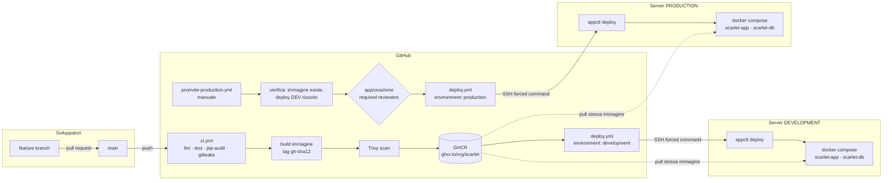
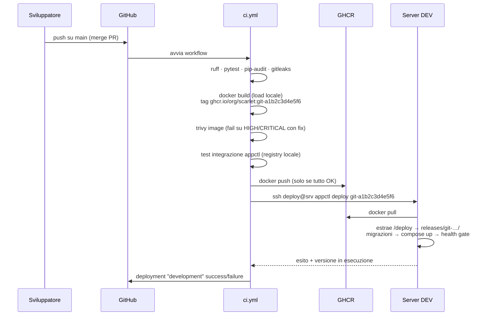
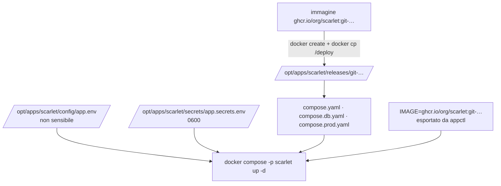
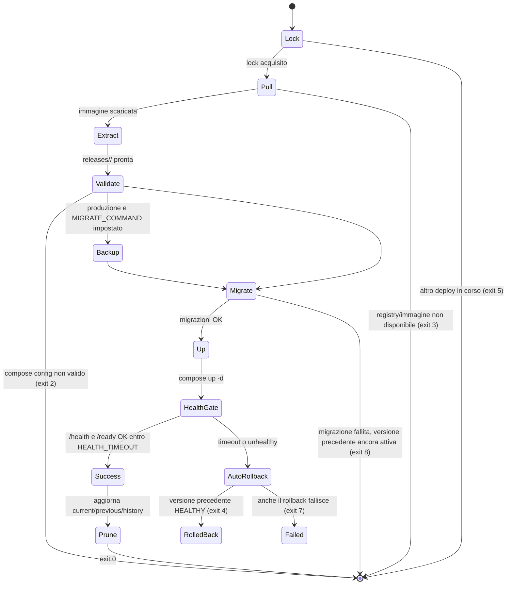

# Architettura target

Questo documento descrive l'architettura della piattaforma Docker interna e della prima
applicazione (Scarlet). Le motivazioni delle scelte sono in `ARCHITECTURE_ANALYSIS.md`.

---

## 1. Vista d'insieme



Principio: **build once, promote the same artifact**. L'immagine viene costruita una sola volta,
identificata dal tag immutabile `git-<sha12>`, e la stessa immagine (stesso digest) viene
deployata prima in development e poi, dopo approvazione, in production.

---

## 2. Componenti

| Componente | Tecnologia | Ruolo |
|------------|------------|-------|
| Applicazione Scarlet | Python 3.12, FastAPI, SQLAlchemy, Alembic | Servizio web "inventario rilasci" con `/health`, `/ready`, `/version` |
| Database | PostgreSQL 16 (container, bind mount) | Persistenza applicativa |
| Immagine | `python:3.12-slim-bookworm`, multi-stage, non-root, read-only | Artefatto immutabile; contiene anche il bundle `/deploy` |
| Registry | GitHub Container Registry | Archivio immagini con tag immutabili |
| CI/CD | GitHub Actions + GitHub Environments | Build, scan, deploy, promozione, rollback |
| Server | Linux + Docker Engine + Compose v2 | Runtime di esercizio |
| appctl | Python 3 (solo stdlib) | Interfaccia operativa unica sul server |
| Reverse proxy | Caddy 2 | TLS, routing per nome host, security headers, access log |
| Backup | `pg_dump` + tar, systemd timer | Salvataggio giornaliero di DB, config, stato |

---

## 3. Flusso di build e tagging



Tag prodotti:

| Tag | Quando | Mutabile | Uso |
|-----|--------|----------|-----|
| `git-<sha12>` | ogni push su `main` | no | tag di riferimento per deploy e rollback |
| `vX.Y.Z` | push di un tag git `vX.Y.Z` | no | alias leggibile dello stesso digest (`release-tag.yml`, nessun rebuild) |
| `pr-<n>` | pull request | sì (sovrascritto a ogni push) | solo build/scan, mai push su GHCR |

Il tag `latest` **non viene usato**.

---

## 4. Il bundle di deploy dentro l'immagine

La directory `deploy/` del repository viene copiata nell'immagine in `/deploy`. Al momento del
deploy, `appctl` la estrae in `/opt/apps/<app>/releases/<tag>/`:



Vantaggi: un solo artefatto; compose e immagine sempre coerenti; rollback = riuso di una release
già estratta; nessun accesso git o SCP dal server.

La configurazione **specifica del server** (porta, nomi DNS, limiti, secrets) resta fuori dal
bundle, in `config/` e `secrets/`, e non cambia tra un deploy e l'altro.

---

## 5. Layout del server

```
/opt/apps/<app>/                  owner deploy:deploy  750
├── app.conf                      manifest applicazione (KEY=VALUE)               640
├── config/app.env                configurazione non sensibile del container      640
├── secrets/app.secrets.env       secrets (DB password, token API)                600
├── releases/<tag>/               bundle compose estratto dall'immagine           750
├── current -> releases/<tag>     symlink alla release attiva
├── state/
│   ├── current.json              deployment corrente (metadata)
│   ├── previous.json             deployment precedente (target di rollback)
│   ├── history.jsonl             storico deployment (append)
│   └── .lock                     lock esclusivo appctl
├── data/postgres/                dati PostgreSQL (bind mount, owner uid 999)     700
├── backups/                      dump DB + tar config (retention N giorni)       700
└── logs/                         log dettagliati di ogni deploy                  750

/var/log/apps/<app>/audit.log     root:appops 0640, chattr +a (append-only)
/opt/appctl/                      installazione appctl (root:root 755)
/usr/local/bin/appctl             wrapper (sudo -u deploy ...)
/opt/platform/proxy/              Caddy condiviso (Caddyfile, sites/, certs/)
/etc/sudoers.d/appctl             regola per il gruppo appops
```

Utenti e gruppi:

| Soggetto | Gruppo | Può |
|----------|--------|-----|
| `deploy` (system user, no login password) | `docker`, `deploy` | eseguire `appctl`, parlare con il socket Docker |
| operatori (account personali) | `appops` | `sudo -u deploy appctl …` e leggere gli audit log; **non** usano `docker` direttamente |
| pipeline GitHub | chiave SSH di `deploy` con forced command | solo `appctl deploy / rollback / status / health / version` |
| `root` | | installazione, aggiornamenti, rotazione secrets |

---

## 6. Flusso di deploy sul server (appctl)



Idempotenza: `appctl deploy` dello stesso tag già attivo e healthy termina con exit 0 senza
ricreare i container (a meno di `--force`). Il pull, l'estrazione e `compose up -d` sono a loro
volta idempotenti.

---

## 7. Health model

| Livello | Come | Significato |
|---------|------|-------------|
| Avviata | container `running` | il processo è partito |
| Viva | `GET /health` → 200 e HEALTHCHECK Docker | il processo risponde (liveness) |
| Pronta | `GET /ready` → 200 | DB raggiungibile e schema allineato (readiness) |
| Dipendenze | `/ready` include `checks.database` | dettaglio delle dipendenze critiche |

`appctl health` mostra tutti i livelli. Il deployment considera riuscito solo `/health` + `/ready`.

---

## 8. Logging

| Tipo | Dove | Accesso |
|------|------|---------|
| Application log | stdout/stderr del container, JSON, driver `json-file` con rotazione (`max-size 20m`, `max-file 5`) | `appctl logs [--follow] [--since 1h] [--tail 200]` |
| Container/Docker log | idem + `docker events` | `appctl logs`, `appctl doctor` |
| Deployment log | `/opt/apps/<app>/logs/deploy-<timestamp>.log` | `appctl logs --deploy` |
| Audit log | `/var/log/apps/<app>/audit.log` append-only | `appctl logs --audit` |
| System log | journald (`docker.service`, sshd, sudo) | `journalctl -u docker` (root) |
| Proxy access log | Caddy, JSON, file con rotazione | `/opt/platform/proxy/logs/` |

Evoluzione: i log JSON su stdout sono già pronti per essere raccolti da Loki/Promtail, Fluent Bit o
ELK senza cambiare l'applicazione.

---

## 9. Evoluzioni previste (non implementate)

| Evoluzione | Quando | Come |
|------------|--------|------|
| Web UI operatori | quando le app sono > 5 o gli operatori non usano SSH | Servizio separato che chiama `appctl --json` via SSH/sudo, con autenticazione SSO, ruoli, audit; **mai** con accesso al socket Docker |
| Blue/green | se il downtime di recreate non è accettabile | Due project compose (`scarlet-blue`, `scarlet-green`) e switch dell'upstream Caddy |
| Osservabilità | quando servono metriche storiche | cAdvisor + Prometheus + Grafana in `/opt/platform/monitoring`, Loki per i log |
| Repository piattaforma separato | seconda applicazione | `platform/` → repo `docker-platform`; workflow riutilizzabili richiamati con `uses: org/docker-platform/.github/workflows/deploy.yml@v1` |
| Rootless Docker | dopo consolidamento | rimuove l'equivalenza root del gruppo docker |

---

## 10. Standard per una nuova applicazione

Ogni applicazione deve fornire:

| Elemento | Requisito |
|----------|-----------|
| Nome | `[a-z][a-z0-9-]{1,31}`; è il nome del project compose e della directory in `/opt/apps` |
| Repository | GitHub, branch `main` protetto |
| Dockerfile | multi-stage, non-root, `HEALTHCHECK`, label OCI, `COPY deploy/ /deploy/` |
| Health | `GET /health` (liveness) e `GET /ready` (readiness); `GET /version` con `version`, `commit`, `image` |
| Config | solo variabili d'ambiente; nessun file di configurazione dentro l'immagine |
| Log | stdout/stderr, una riga per evento, preferibilmente JSON |
| Compose | `deploy/compose.yaml` + override per ambiente; servizio principale chiamato `app` |
| Manifest | `platform/server/templates/app.conf` compilato per ambiente |
| Secrets | GitHub Environments (pipeline) + `secrets/app.secrets.env` sul server |
| Workflow | `ci.yml` richiama `deploy.yml`; `promote-production.yml` con approvazione |

La procedura completa è in `docs/ONBOARDING_NUOVA_APPLICAZIONE.md`.
