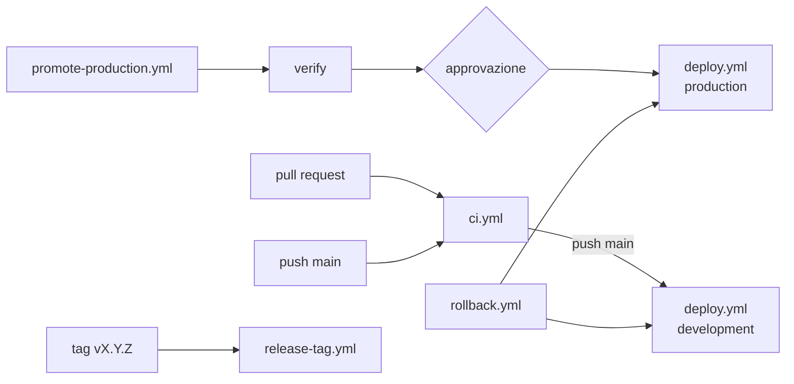

# GitHub Actions

## 1. Workflow

| File | Trigger | Cosa fa |
|------|---------|---------|
| `ci.yml` | push su `main`, pull request, manuale | lint (ruff, actionlint, shellcheck) · unit test (SQLite + PostgreSQL) · pip-audit · gitleaks · **build** immagine (una volta) · Trivy · test di integrazione appctl · push su GHCR (solo `main`) · deploy in development |
| `deploy.yml` | `workflow_call` | deploy/rollback di un tag su un environment via SSH + `appctl`; smoke test; riepilogo |
| `promote-production.yml` | manuale (`image_tag`) | verifica immagine nel registry e deploy dev riuscito per quel commit → job con environment `production` (approvazione) → `deploy.yml` |
| `rollback.yml` | manuale (ambiente, tag opzionale) | `deploy.yml` con `action: rollback` |
| `release-tag.yml` | push tag `v*.*.*` | aggiunge l'alias semver alla stessa immagine, crea la GitHub Release |
| `registry-cleanup.yml` | settimanale, manuale | elimina le versioni senza tag del package GHCR |

## 2. Autenticazione

* **GHCR**: `GITHUB_TOKEN` del run con `packages: write` (build) o `packages: read` (verifiche e
  pull sul server durante il deploy: `deploy.yml` lo passa a `remote-deploy.sh`, che lo invia ad
  `appctl deploy --registry-login-stdin` via stdin; login e logout sono automatici). Nessun PAT
  nei workflow e nessuna credenziale permanente del registry sul server;
* **server**: chiave SSH dedicata per ambiente (secret dell'Environment), utente `deploy`, forced
  command `appctl-ssh-gate`, host key verificata (`StrictHostKeyChecking=yes`);
* **API GitHub** (deployments, commits): `GITHUB_TOKEN` con `deployments: read`.

Le azioni di terze parti usate: `actions/*`, `docker/*`, `aquasecurity/trivy-action`,
`actions/delete-package-versions`. RECOMMENDED: pin per SHA (Dependabot aggiorna anche i pin).
Gitleaks, actionlint e shellcheck girano come container con tag fissato.

## 3. Configurazione da fare su GitHub (una tantum)

### Environments (Settings → Environments)

| Environment | Secrets | Variabili | Protection rules |
|-------------|---------|-----------|------------------|
| `development` | `DEPLOY_HOST`, `DEPLOY_SSH_KEY`, `DEPLOY_SSH_HOST_KEY` | `APP_URL` (es. `https://scarlet-dev.intranet.local`), opzionali `DEPLOY_USER`, `DEPLOY_PORT`, `DEPLOY_RUNNER`, `APP_NAME` | nessuna |
| `production` | idem (valori di produzione) | idem | **Required reviewers** (R4), "Prevent self-review", deployment branches: `main` e tag |

`DEPLOY_SSH_HOST_KEY` = output di `ssh-keyscan -t ed25519 <host>` (una riga).
`DEPLOY_RUNNER` = label di un self-hosted runner (es. `self-hosted`) se i runner GitHub non
raggiungono i server (ASSUMPTION A6); vuoto = `ubuntu-latest`.

### Repository

* Settings → Actions → General: "Read and write permissions" **non** necessario (i permessi sono
  dichiarati per job); consentire le azioni usate;
* Settings → Branches → `main`: require PR, require status checks (`Lint`, `Unit test`,
  `Security scan`, `Build, scan, integration, push`), require review from code owners, no force push;
* Packages: il package `scarlet` nasce al primo push; renderlo privato e collegarlo al repository
  (Package settings → Manage Actions access: repository con ruolo write, così `GITHUB_TOKEN` può pushare);
* Dependabot: abilitato da `.github/dependabot.yml`; abilitare anche Dependabot alerts.

## 4. Il job di build in dettaglio

1. tag = `git-<12 caratteri dello SHA>` (`pr-<n>` per le PR, mai pubblicato);
2. `docker/build-push-action` con `load: true` (immagine solo nel runner) e cache GitHub Actions;
3. Trivy sull'immagine locale: fallisce su HIGH/CRITICAL con fix disponibile (`ignore-unfixed`);
4. test di integrazione della piattaforma con **quella** immagine (registry locale nel runner);
5. solo se tutto è verde e l'evento è un push su `main`: `docker push` della stessa immagine;
6. output: `image_tag`, `image`, `digest`; riepilogo nel run.

Il tag e il digest sono nel riepilogo del run ("Immagine pubblicata"): è ciò che serve per
promuovere.

## 5. Promozione in produzione, passo-passo

1. Actions → *Promote to production* → *Run workflow* → `image_tag` = `git-<sha12>` o `vX.Y.Z`;
2. job `verify`: tag valido, immagine presente su GHCR (nessun rebuild: si legge il commit dalla
   label OCI), deploy in development riuscito per quel commit (API deployments);
3. job `deploy`: entra in *Waiting* finché un reviewer approva (Review deployments);
4. dopo l'approvazione: SSH → `appctl deploy <tag>` sul server di produzione, health gate, rollback
   automatico in caso di fallimento, smoke test (`appctl health --wait 30`, confronto commit);
5. esito nel riepilogo e nello storico dell'Environment `production`.

`skip_development_check` esiste per le emergenze (es. hotfix con development non disponibile) e va
motivato nel run.

## 6. Failure handling della pipeline

| Fase | Fallimento | Comportamento | Exit / segnale |
|------|------------|---------------|----------------|
| lint/test/security | errore | run rosso, nessun build | job failed |
| build | errore Docker | run rosso | job failed |
| Trivy | CVE HIGH/CRITICAL con fix | run rosso, nessun push | exit 1 |
| integrazione | scenario fallito | run rosso, nessun push | pytest |
| push | registry GHCR non disponibile | run rosso; ripetere il run | docker push |
| deploy: secrets mancanti | configurazione | job failed con messaggio esplicito | exit 1 |
| deploy: SSH | rete/chiave/host key/gate | `::error::SSH verso ... fallito` | exit 20 |
| deploy: appctl | exit code di appctl | messaggio con exit code e rimando a OPERATIONS.md | 2-9 |
| deploy: health fallita | rollback automatico sul server | `::error:: ... ripristinato la versione precedente` | 4 |
| deploy: app giù | rollback fallito | `::error:: APPLICAZIONE NON DISPONIBILE` | 7 |
| smoke test | commit diverso / non sana | `::error::smoke test fallito` | 22 |
| timeout | job > 30 min | job cancellato; sul server il lock si libera alla fine del processo appctl (che continua) | — |

Notifiche: il riepilogo del run e lo stato dell'Environment; email/Teams tramite webhook è un TODO
(RECOMMENDED C4).

## 7. Registry GHCR

| Aspetto | Scelta |
|---------|--------|
| naming | `ghcr.io/<owner>/<repo>:<tag>`; tag `git-<sha12>` (immutabile), `vX.Y.Z` (alias immutabile), mai `latest` |
| visibilità | privato (R5) |
| accesso in scrittura | solo `GITHUB_TOKEN` dei workflow del repository |
| accesso in lettura dai server | `GITHUB_TOKEN` temporaneo durante il deploy (nessun token sul server); opzionale utente tecnico con PAT `read:packages` per i pull manuali |
| scansione | Trivy in CI prima del push; Dependabot per le basi. GHCR non scansiona autonomamente |
| retention | i tag non vengono cancellati automaticamente (base del rollback); `registry-cleanup.yml` rimuove solo le versioni untagged. Pulizia manuale dei tag più vecchi di 6 mesi: Packages → versions, oppure `gh api -X DELETE /user/packages/container/scarlet/versions/<id>` dopo aver verificato che non siano deployati (`appctl history` su ogni server) |
| lifecycle | tag nuovo a ogni merge su `main`; alias semver a ogni release; immagine promossa senza rebuild |

## 8. Manutenzione dei workflow

* `actionlint` in CI valida la sintassi; modificare i workflow via PR;
* le versioni delle azioni sono aggiornate da Dependabot (`github-actions` ecosystem);
* per spostare la piattaforma in un repository dedicato: `deploy.yml` e `promote-production.yml`
  diventano `uses: <org>/docker-platform/.github/workflows/deploy.yml@v1` (ARCHITECTURE.md §9).
